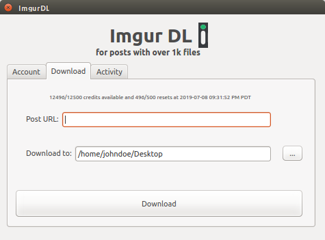

<h1 align="center">ImgurDL</h3>

<div align="center">

  []() 
  [](https://github.com/acomputerguy/ImgurDL/issues)
  [](https://github.com/acomputerguy/ImgurDL/pulls)
  [](/LICENSE.txt)

</div>

---

<p align="center">
Application will tackle the following issues regards to downloading a post from Imgur:

* Built-in feature to download a post from Imgur unable to exceed 1000 medias
* Go-around methods like adding .zip to URL are unreliable
* Tools do not ensure integrity of media in use
    <br> 
</p>

## 📝 Table of Contents
- [About](#about)
- [Getting Started](#getting_started)
- [Deployment](#deployment)
- [Usage](#usage)
- [Built Using](#built_using)
- [Acknowledgments](#acknowledgement)
- [FAQ](#FAQ)

## :exclamation: About <a name = "about"></a>
Application has 3 benefits:

* Quick and easy GUI (use my executable to get started)
* Integrity check (assures all forms of media are downloaded)
* It's the right way! (with Client ID and Shared Secret)



## 🏁 Getting Started <a name = "getting_started"></a>
Follow the instructions below on installing the dependencies and how to get the project up and running on your local machine for development.
These instructions will get you a copy of the project up and running on your local machine for development and testing purposes. See [deployment](#deployment) for notes on how to deploy the project on a live system.

### Prerequisites
1) Requires obtaining a client ID and secret key from your Imgur account

2) The following dependencies are used
- httplib2 v0.8
- hurry.filesize v0.9
- imgurpython v1.1.7
- PyYAML v3.13
- urllib3 v1.23
- PyQt5 v5.1.33

### Installing

To install the necessary dependencies and establish paths to them for the project, run:

    $ pipenv install -r requirements.txt
    
If you already installed, start the shell with :

    $ pipenv shell

Or if you want to manually install each dependency, do

    $ python3 -m pip install <package>
    
or
    
    $ pip3 install <package>

### Development Process

Install the following (PyQt5 GUI Framework and tools to create the GUI builder and work with your codebase):
```
apt-get install python3-pyqt5
apt-get install pyqt5-dev-tools
apt-get install qttools5-dev-tools
```

Run as root and enter your password

    $ sudo
Open up the GUI Designer tool (create/modify the alias to keep the file path simple) with 

    $ /usr/lib/x86_64-linux-gnu/qt5/bin/designer
(or simply type in _designer_ and replace file path _qt4_ with _qt5_)

To write designer changes to the file do:

    $ pyuic5 sample.ui > sample.py
Run the python code with:

    $ python3 sample.py

## 🎈 Usage <a name="usage"></a>
For using the executable in the repository:

Run ImgurDL in the *dist* directory after cloning/downloading

    $ ImgurDL/src/dist/ImgurDL
    
Executable file:

link to exe stored in repo

## ⛏️ Built Using <a name = "built_using"></a>
- [PyQt5](https://pypi.org/project/PyQt5/) - GUI Framework

## 🎉 Acknowledgement <a name = "acknowledgement"></a>
- Resource to set up local environment:
https://www.codementor.io/deepaksingh04/design-simple-dialog-using-pyqt5-designer-tool-ajskrd09n

- PyQt5 Documentation:
https://www.riverbankcomputing.com/static/Docs/PyQt5/

- Imgur API Documentation:
https://api.imgur.com/

## :question: FAQ <a name = "FAQ"></a>

Why can't I make it go faster?

Being able to concurrently download multiple pieces of media for multithreading is not the best use case for multithreading.
It's unfriendly on the server and could raise some questions at Imgur HQ.

